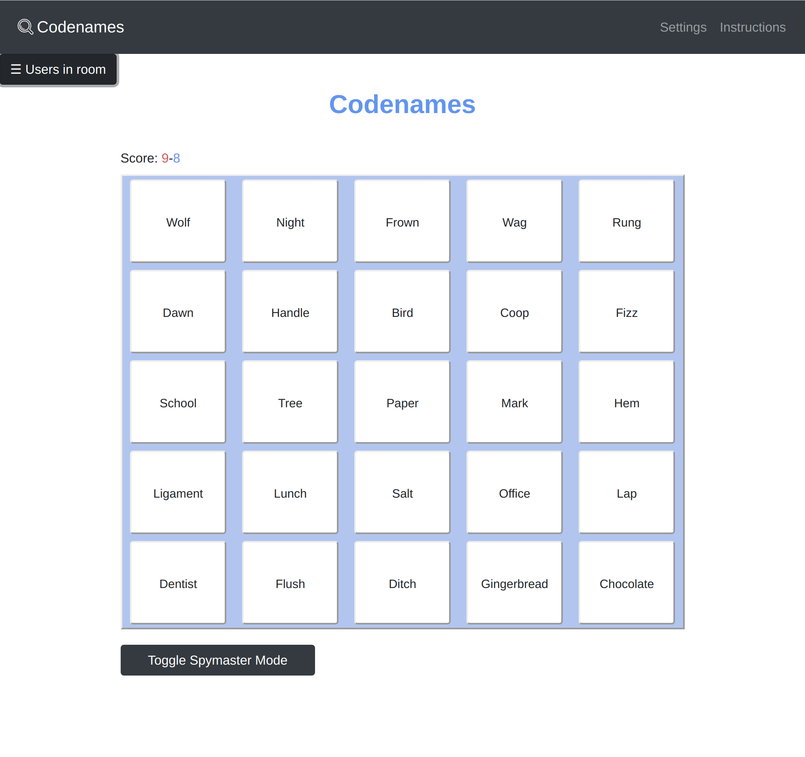

# Codenames-client: A React Front-end Client for the popular codenames game

    

## Description

The popular multiplayer game codenames can be played remotely via a desktop or a mobile device through this front end app. A live version of the app can be found [here](http://codenames-live.herokuapp.com/).

Users can create and connect to virtual rooms which contain a board to play the codenames game collaborativelly with their friends. The game is designed with the assumption that users can communicate with each other, with a parallel video call for instance, so that they can share their clues.

## Steps for deployment

- This front-end client needs to be supported by a Node.js server found in [this repository](https://github.com/StamatisKourkoutas/Codenames_server). Firstly, install and run this server.
- After this, clone this project, navigate to the project directory and run:

    **`npm install`** This installs all the necessary dependencies to build our application

    **`npm start`** This runs the app in development mode.

- After these, open [http://localhost:3000](http://localhost:3000) to view the front-end client in your browser.
